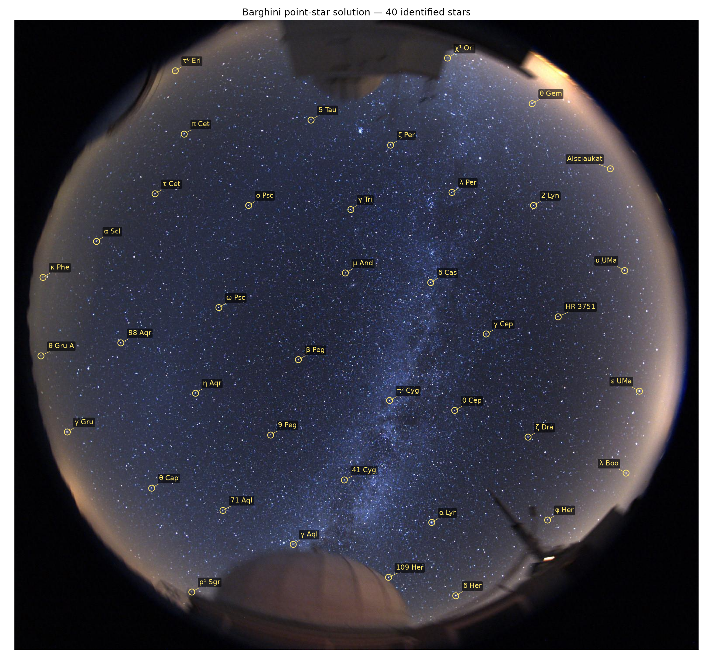
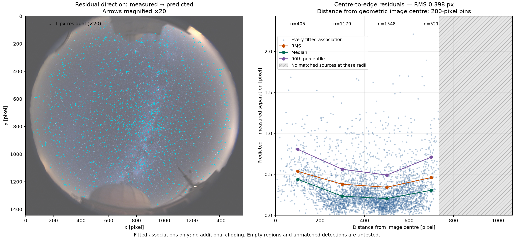

Version 0.4.1: use `./go_v0.4.1.sh /full/path/to/image.jpg` (or `./go.sh`).
Gaia magnitude 7.5, horizon-inclusive extinction fitting, explicit saturation
flags, and a red X for the conditional/provisional extinction zenith are enabled.
Saturated stars remain eligible for astrometry but are excluded from photometry.
The blind planet search remains unfinished; reports state when it was not run.

# WIDE-FIELD SOLVER

**Version 0.4.1 — horizon photometry and zenith display.** This development
version preserves a local Gaia DR3 catalogue and a reproducible same-image experiment,
including paired spatial resampling of the stellar epoch and camera fit.
The default catalogue remains Tycho/Hipparcos pending evaluation. Version 0.3.0
proper-motion astrometry and blind photometric zenith are preserved; `demo.sh`
still explicitly replays the historical `v0.1.0` native-catalogue baseline.

The scientific contract is [GOAL.md](GOAL.md). See the
[Gaia experiment](docs/GAIA_V04.md),
[proper-motion numerical changes](docs/PROPER_MOTION_V03.md), and
[implemented-versus-planned feature inventory](docs/FEATURE_STATUS.md).

To use Gaia for a blind solve:

```sh
./solve.sh image.jpg --catalog data/stars_gaia_dr3_g75.csv \
  --output results/gaia-solve --offline
```

To compare both catalogues on the same image with 32 paired spatial subsamples:

```sh
OPENBLAS_NUM_THREADS=1 uv run --frozen python scripts/compare_catalogues.py \
  examples/milky_way/input.jpeg --output results/catalogue-comparison
```

Both full solves start from pixels. The subsamples are an explicit sensitivity
experiment; the normal solver continues to use all eligible detected sources.

by Peter Thejll and Chris Flynn

Astrometry directly from untrailed, wide-field star images, using the
Barghini O/Z fish-eye model. Find dots, identify a small star pattern, then
fit the lens across the image.

The included Milky Way example yields **3,653 catalogue associations at
0.398-pixel RMS**, with 40 spatially distributed star labels. All detected
sources are available for fitting; no stars are withheld.



## One-command Gaia analysis (0.4.1)

```sh
./go_v0.4.1.sh /full/path/to/image.jpg
```

`./go.sh` is an alias. The launcher verifies solver version 0.4.1, selects the
Gaia catalogue and fits stellar epoch blindly. Ordinary star names come from a
local display-only cache, with missing aliases queried from SIMBAD after fitting. From the preserved
root checkout it uses `.worktrees/zenith-v0.4.1`; in this checkout it runs locally.
Each invocation creates a unique folder under `results/runs/` beside the launcher,
with the image name, version and run timestamp. The folder contains `run.log` and
an `analysis/` directory holding all generated images, tables and the PDF report.
The output locations are printed; repeated runs preserve earlier results.
Use `--version` or `--help` to inspect the launcher. The root checkout retains
`go_v0.4.0.sh`, which delegates to the preserved `.worktrees/gaia-v0.4` runtime.

## Try the preserved example

Requires Git and [uv](https://docs.astral.sh/uv/getting-started/installation/).
Python 3.12 and the exact dependency versions are recorded in the repository.
Linux is the tested platform; the shell entrypoints also require Bash.

```sh
git clone git@github.com:hotblack43/WIDE-FIELD-SOLVER.git
cd WIDE-FIELD-SOLVER
uv sync --frozen
./demo.sh
```

Open `results/demo/identified_40_stars.png`. The demo starts from the included
JPEG and runs detection, blind identification, and the complete Barghini fit
anew. It then checks the numerical result against the preserved baseline.
The cached ordinary names are used only when drawing labels. No saved camera,
star associations, date, location or sky-position hint seeds the solution.

Installation downloads dependencies, including tetra3's bundled pattern
database. The installed demo runs offline. Allow a few minutes on a typical
machine. Outputs are never overwritten: for another run use
`./demo.sh --output results/demo-2`.

| Included example, 1569 × 1444 pixels | Verified baseline |
|---|---:|
| Measured sources | 3,688 |
| Catalogue associations | 3,653 |
| Fitted residual RMS / median | 0.398 / 0.249 px |
| Broad blobs / saturated sources | 82 / 930 (overlapping categories) |
| Unmatched measurements | 35 |
| Distributed star labels | 40 |

Names favour Bayer designations such as α Ori and α² Cap, followed by common
names, Flamsteed designations or catalogue identifiers. Selection favours
bright, compact matches below one pixel residual and spreads labels across
the field.

## Solve another image

```sh
./solve.sh /path/to/stars.jpg --output results/my-image --labels 40
```

Existing output directories are protected by default. Use a new output name;
`--overwrite` explicitly permits replacement. All stars remain available to
matching and fitting, including large and saturated detections.

The default `--epoch-mode fit` searches a stellar epoch without using the
observation timestamp. To propagate to a supplied Julian year instead:

```sh
./solve.sh /path/to/stars.jpg --output results/my-image-2026 \
  --epoch-mode fixed --epoch-year 2026.7 --offline
```

Use `--epoch-limits 1900 2100` to set the stellar search interval. A supplied
epoch is labelled as supplied, and an unidentifiable stellar epoch is reported
as unresolved with a clearly labelled provisional best-fit solution. Zero-motion
or numerically flat profiles use an explicitly adopted J2000.0 solution. `--epoch-mode catalog`
is the historical native-position replay, without proper-motion propagation.

This queries SIMBAD for display names. Add `--offline` to retain catalogue
identifiers without network access, or also supply `--names-cache names.json`.
Supported input is a raster image readable by Pillow, converted to 8-bit RGB.
The solver is tuned and demonstrated on the included fisheye image;
success across arbitrary cameras and fields remains to be established.

If detection succeeds but the run ends with
`No blind catalogue bootstrap from the measured training dots`, see the
[blind-bootstrap failure diagnosis](docs/BOOTSTRAP_FAILURES.md). It records a
confirmed working point-source control, the diagnosed Paranal failure, the
current tetra3 search limits, and the requirements for improving bootstrap
robustness without withholding sources or weakening the historical regression.

For the complete per-image analysis, use the standalone entrypoint:

```sh
./analyse.sh /path/to/stars.jpg --output results/my-image --offline
```

It starts from the image, profiles stellar epoch while refitting the Barghini
camera, and saves consistent propagated coordinates. It then measures RGB
aperture photometry, searches physical zenith using the green-channel regression
`machine magnitude - catalogue magnitude = zero point + k * airmass`, and fits an
independent empirical astrometric-refraction diagnostic. Every trial zenith uses
the same eligible photometric sources; zero point and extinction slope are
nuisance parameters. A radial-response sensitivity fit checks one important
vignetting ambiguity. These downstream diagnostics do not yet jointly constrain
the saved astrometric epoch.

No observing site or time is used by the blind fits. Metadata stays hidden in the
report unless `--compare-metadata` is supplied. For example:

```sh
./analyse.sh /path/to/stars.jpg --output results/my-comparison --offline \
  --compare-metadata --observation-time 2026-09-13T22:00:00 \
  --latitude 28.7606 --longitude -17.8850 --elevation-m 2326
```

Only after all fits finish does this option reveal supplied or archived metadata
and write `metadata_comparison.json`. The comparison includes the epoch difference
and latitude inferred from the physical zenith and the epoch's celestial pole;
an unresolved zenith remains explicitly provisional. Metadata never tunes the fit.

A blind planetary-epoch search is a separate, unfinished objective. The default
analysis records it as `not_run`; the older metadata-centred lookup is disabled
on this path. The stellar date is not a substitute for this separate planetary
clock.

The analyser classifies stored channels as RGB or effectively monochrome. RGB
images receive R, G and B panels; G shows the actual zenith nuisance regression,
while R and B are post-fit diagnostics. Effectively monochrome images receive
one panel. `report_<camera>_<UTC>.pdf` has two A4 portrait pages: results on page 1
and lens/refraction formulae on page 2. A hidden timestamp appears as `UTCunknown`.
Boundary-limited or weak stellar epoch, zenith and refraction fits are reported
as unresolved, even when a numerical best fit exists.

For detection alone:

```sh
uv run --frozen python point_star_detection.py /path/to/stars.jpg --output results/dots
```

To change labels on an existing solution without refitting:

```sh
./solve.sh examples/milky_way/input.jpeg --annotations-from results/demo \
  --output results/relabelled --labels 20 --offline \
  --names-cache examples/milky_way/reference/display_names.json
```

Each complete run produces:

- `result.json`: fitted camera, convergence, residuals, processing history and checksums.
- `star_coordinates.csv`: measured and predicted pixels, original and propagated
  catalogue coordinates, measured sky coordinates, epochs, proper-motion availability and IDs.
- `blob_candidates.csv`: broad/saturated sources, including unmatched objects.
- `identified_40_stars.png`: the requested number of named stars (40 by default).
- `astrometry_overlay.png`: measured cyan crosses and predicted orange circles at their true positions; unmatched detections are pink crosses.
- `astrometry_residuals.png`: residual vectors magnified ×20 and centre-to-edge residual statistics.
- `radial_residuals.csv` / `.json`: counts, RMS, median, 90th percentile and signed radial offsets by image-centred annulus.
- `report_<camera>_<UTC>.pdf`: two-page scientific report; results on page 1 and formulae on page 2.
- `science_summary.json`: stellar epoch, refraction, photometry/extinction and planet results.
- `stellar_photometry.csv` and `extinction_fit.png`: aperture measurements and the fitted magnitude-difference relation; colour images receive separate R, G and B panels.
- `photometric_zenith.json` and `photometric_zenith_profile.png`: trial-zenith regression objective, membership and sensitivity results.
- `metadata_comparison.json`: optional post-fit comparison, only with `--compare-metadata`.
- `report_sky_overlay.png`: readable representative star labels.
- `stellar_epoch.json` and `stellar_epoch_profile.png`: all-star robust-cost epoch profile, conditional interval and adopted epoch.
- `refraction_fit.json`: empirical tangent-series refraction fit and model-selection diagnostics.
- `planet_epoch.json`: explicit `not_run` status until blind planetary epoch search is implemented.
- `dots/`, `bootstrap.json`, `display_names.json`, `labelled_stars.json`: measurement and naming audit.

## Does the fit deteriorate towards the edge?

The [two-symbol overlay](examples/milky_way/diagnostics/astrometry_overlay.png)
plots both coordinates independently for all 3,653 fitted associations, without
magnifying their separation. Open the full-resolution image and zoom in.
The plotting code applies no astrometric correction or cosmetic shift. Any
future correction must come through the Barghini model and its exported
coordinates; remaining discrepancies stay visible in the overlay.



The radial bands give:

| Distance from image centre | Fitted stars | RMS | 90th percentile |
|---|---:|---:|---:|
| 0–200 px | 405 | 0.536 px | 0.806 px |
| 200–400 px | 1,179 | 0.379 px | 0.562 px |
| 400–600 px | 1,548 | 0.343 px | 0.492 px |
| 600–800 px | 521 | 0.461 px | 0.711 px |

There is a modest outer-band rise, with no progressive edge blow-up in these
matched stars. Small systematic structure remains visible in the magnified
vectors; for example, the inner band has a mean outward radial offset of
0.329 px. The outermost matched source is at radius 734.75 px, so the last
populated band is only partially sampled. The hatched part of the plot has
no matched sources and is untested. All fitted pairs are included, with no
extra residual clipping. These remain fit residuals after catalogue matching;
unmatched detections have no evaluated star-pair residual.

A field identification and a good distortion correction are separate aspects
of astrometry. Astrometry.net fits
[polynomial distortion terms](https://astrometry.net/doc/readme.html);
an insufficient or poorly constrained distortion model can plausibly explain
good central alignment with increasing edge errors. Diagnosing an old solve
would require its WCS and measured positions. This image's comparison does
not establish that every astrometry.net configuration has such a problem.

Regenerate diagnostics from an existing solve, without refitting:

```sh
uv run --frozen python point_star_diagnostics.py examples/milky_way/input.jpeg \
  --solution results/demo --output results/diagnostic-check
```

## Method and scope

The detector measures intensity centroids with local background subtraction,
growing its window to accommodate large saturated blobs. tetra3 supplies an
initial blind star-pattern identification from a small patch. The global fit
uses the [Barghini et al. (2019)](https://doi.org/10.1051/0004-6361/201935580)
O/Z equations (5), (6), and (11), with progressive matching and a robust fit.
See [method notes](docs/METHOD.md) and [catalogue provenance](data/README.md).

The reported residuals describe fitted associations selected with a three-pixel
matching gate. They are not independent accuracy estimates or a completeness
measurement. The celestial reference direction Z does not establish a local zenith.
The complete analyser independently fits empirical astrometric refraction and
photometric zenith from the image. Neither uses site/time metadata. Their coupling
to each other and to the stellar-epoch objective remains unfinished. Broad and
saturated blobs remain available to astrometric association and fitting, even
when their photometry is unusable.

In our bounded [solve-field comparison](docs/COMPARISON.md), direct full-image
attempts were unsolved. On a small crop, solve-field with our measured dots
and third-order SIP achieved comparable local precision. The demonstrated
benefit here is the full-field lens solution.

## Keeping this result safe

This project contains its own code, catalogue, example and dependency lock.
It has no runtime dependency on the trail-processing repository. The
**`v0.1.0` tag** preserves the first verified standalone release; future work
can proceed on `main` while that release remains recoverable:

```sh
git switch --detach v0.1.0
uv sync --frozen
./demo.sh --output results/baseline-replay
```

The checked-in `examples/milky_way/reference/` holds the original annotated
image and association tables. `baseline.json` records both exact observations
and explicit cross-platform acceptance bounds. CI runs the synthetic/unit
checks and a fresh pixel-to-sky demo on pushes and pull requests.
It also reloads the saved camera, reproduces the exported coordinates and
residuals, and checks catalogue identities against the reference table.

```sh
uv run --frozen python -m unittest discover -v
./demo.sh --output results/regression-1
```

The tests cover subpixel centroids, saturated blobs, streak rejection, forward
and inverse geometry, recovery of a synthetic distorted field, spatial label
selection, offline names and rejection of degraded regression results.

See the [performance profile](docs/PERFORMANCE.md) for measured runtime
hotspots and the lossless PNG-encoding optimization.

## Future extensions

- Extend the current single-passband extinction fit with catalogue colours,
  vignetting terms and repeated-image transparency constraints; the design
  considerations remain in
  [the research note](docs/PHOTOMETRY_ZENITH_EXTINCTION_NOTE.md).
- Extend the Gaia comparison across more images and catalogue quality/colour
  selections; establish accuracy before changing the default catalogue.
  Evaluate later Gaia releases when available.
- Test more fisheye lenses, sky regions and exposure levels, with documented
  limits on where the solution is trustworthy.
- Export a convenient pixel-to-sky interface and interoperable astrometric
  products for downstream analysis.

These are development directions; the tagged baseline retains the catalogue
and method that produced the demonstrated result.

## Provenance

Preserved from Peter Thejll's point-star experiments on 13 September 2026.
This is a private research repository. The supplied photograph's original
photographer and redistribution terms are undocumented; see [NOTICE](NOTICE.md)
before any public release. Third-party catalogue and software sources are
identified there.
