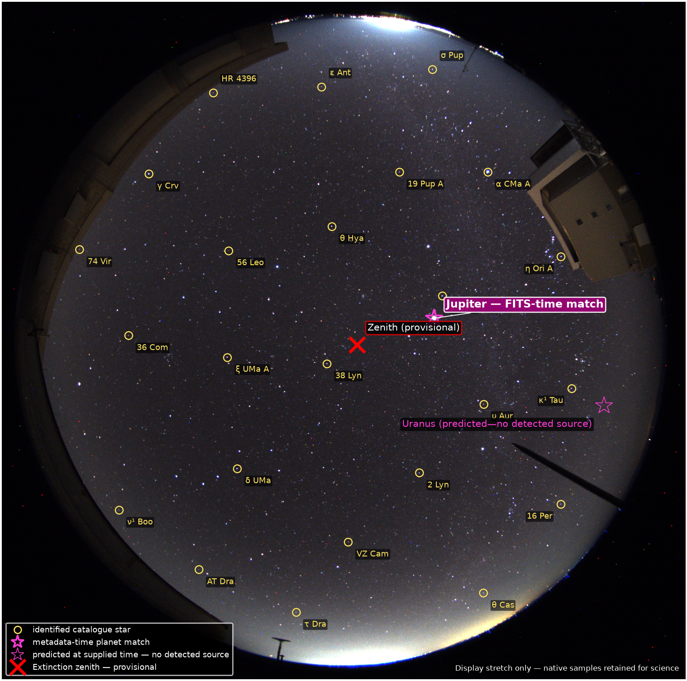

# WIDE-FIELD SOLVER

**Blind, full-frame astrometry for fisheye and other extreme wide-field images**

Peter Thejll and Chris Flynn

[](https://github.com/hotblack43/WIDE-FIELD-SOLVER/actions/workflows/tests.yml)
[](pyproject.toml)
[](v9/README.md)
[](docs/SCIENTIFIC_STATUS.md)
[](LICENSE)

WIDE-FIELD SOLVER finds point-source stars directly from an image, identifies
them against a catalogue, and fits the Barghini O/Z fisheye model across the
whole detector. The stellar solution is seeded without an observing site,
camera orientation or image timestamp.

<p align="center">
  
</p>

<p align="center"><em>
MMT Observatory colour FITS image. The labels are generated after the astrometric
fit; the display stretch does not change the native scientific samples.
</em></p>

## What it does

- detects ordinary, undersampled, broad and saturated point sources;
- bootstraps a blind sky identification with `tetra3`;
- fits the Barghini fisheye camera model in angular sky coordinates;
- propagates Gaia proper motions and tests a stellar epoch;
- measures instrumental multi-channel photometry and a provisional
  image-derived zenith/extinction constraint;
- searches for planetary position matches in a separate, explicitly labelled
  stage; and
- saves an illustrated PDF report, machine-readable tables, provenance and an
  append-only SQLite record.

## Current single-image result

The v0.9.0 solver was run on one MMT Observatory colour FITS image dated
2026-01-15. It obtained:

| Measure | Result |
|---|---:|
| Matched stars | 1,380 |
| Astrometric RMS | **0.3267 px** |
| Median residual | **0.2350 px** |
| 90th-percentile residual | **0.4964 px** |
| Angular RMS | 2.502 arcmin |

These are fitted residuals, not an independent withheld-star accuracy test.
The result is nevertheless directly comparable in detector units with the
approximately 0.33-pixel whole-night result reported for the MMTO camera's
operational calibration.

## Quick start

The tested platform is Linux. Install
[`uv`](https://docs.astral.sh/uv/), then run:

```bash
git clone https://github.com/hotblack43/WIDE-FIELD-SOLVER.git
cd WIDE-FIELD-SOLVER
uv sync --project v9 --frozen
./go9.sh /full/path/to/image.fits
```

Compressed FITS input is accepted directly:

```bash
./go9.sh /full/path/to/image.fits.bz2
```

Each run gets a unique directory. The command prints the location of
`analysis/report.pdf`, the run log and `stars.sqlite` when it starts and again
when it finishes.

## Read next

| If you want to… | Read… |
|---|---|
| install and solve a first image | [Quick start](docs/QUICKSTART.md) |
| understand the fitted model | [Method](docs/METHOD.md) |
| interpret reports and output files | [Results and outputs](docs/RESULTS.md) |
| see what is validated and what remains provisional | [Scientific status](docs/SCIENTIFIC_STATUS.md) |
| choose among preserved versions | [Version guide](docs/VERSIONS.md) |
| see every launcher and advanced option | [Complete reference](REFERENCE.md) |

The documentation source is configured for MkDocs/Read the Docs. Build it
locally with:

```bash
uvx --with mkdocs-material==9.7.7 mkdocs==1.6.1 build --strict
```

## Scientific boundaries

The code distinguishes a successful plate solution from an identified physical
zenith or observation epoch. Instrumental count rates are not calibrated fluxes.
Metadata is not allowed to seed or tune the stellar astrometric fit; when used
later for planetary analysis it is labelled as metadata-conditioned. See
[the durable scientific goal](GOAL.md) and
[the detailed v0.9.0 feature inventory](v9/docs/FEATURE_STATUS.md).

## Citation, releases and reuse

The project-authored software is copyright © 2026 Peter Thejll and Chris Flynn
and is available under the [BSD 3-Clause License](LICENSE). You may use, modify
and redistribute it under those terms. If you use WIDE-FIELD SOLVER in
scientific work, please use the repository's [`CITATION.cff`](CITATION.cff);
GitHub's **Cite this repository** menu supplies APA and BibTeX forms.

The latest packaged release is v0.6.0; current development is in the preserved
v0.9.0 line under `v9/`. Historical solvers remain available for reproducible
comparison and are protected by recorded manifests and regression tests.

The BSD licence covers project-authored software, not third-party code,
catalogues or images. Those materials retain their own terms. Read
[NOTICE.md](NOTICE.md) before redistribution.

Analyses and publications using MMTO all-sky-camera data should acknowledge the
MMT Observatory. We thank Tim Pickering and the Observatory for maintaining the
camera and making its colour FITS archive available.
